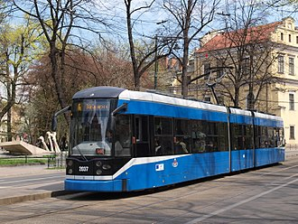

# Mock-test

1. Filak Michal, Filak Michal, tasks 4 and 5.
2. Norbert Czerw, Bomber1321, tasks 1 and 6.
3. Jakub Horowski, Jakub Horowski, tasks 2 and 3.

# INTRODUCTION

Transport in Kraków is based around a fairly dense network of tramway and bus lines operated by a municipal company, supplemented by a number of private minibus operators. Local trains connect some of the suburbs. The bulk of the city’s historic area has been turned into a pedestrian zone with golf buggies, rickshaws and horse buggies; however, the tramlines run within a three-block radius.

Rail connections are available to most Polish cities. Trains to Warsaw depart every hour. International destinations include Berlin, Bratislava, Prague, Hamburg, Lviv, Kyiv, and Odesa (June–September). The main railway station is located just outside the Old Town District and is well-served by public transport.There is an international airport 11 km (7 mi) west of the city. Direct trains cover the route between the main railway station and the airport in 18 minutes.

Kraków's airport, (John Paul II International Airport Kraków-Balice, Polish: Międzynarodowy Port Lotniczy im. Jana Pawła II Kraków-Balice) is 11 km (7 mi) west of the city. Direct trains cover the route between Kraków Main station and the airport in 16 minutes, following an upgrade of tracks on the line in 2015.The annual capacity of the airport is estimated at 1.3 million passengers; however, in 2007 more than 3.042 million people used the airport, giving Kraków Airport 15 percent of all air passenger traffic in Poland. The passenger terminal is undergoing extension and is being adapted to meet the requirements of the Schengen Treaty.

# DATA
Prices of tickets depent on how long yyou want them to last and what zones you will be using.
These are the prices  of some tickets:

|Ticket type|Zone|Full Fare|Reduced Fare|
|------|------|-------|-------|
|20-minute|1+2+3|4.00|2.00|
|60-minute|1+2+3|6.00|3.00|
|90-minute|1+2+3|8.00|4.00|
|24-hour|1|17.00|8.50|

# IMAGES

